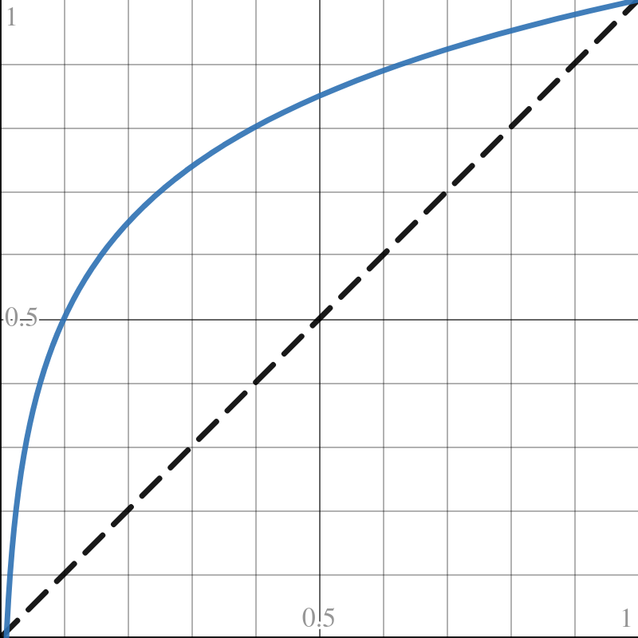

# Brightness
According to the [Weber-Fechner law](https://en.wikipedia.org/wiki/Weber%E2%80%93Fechner_law) humans perceive brightness logarithmically, not linearly. [brightness.py](brightness.py) wraps xbacklight and uses the logarithmic dimming curve in the figure below.

